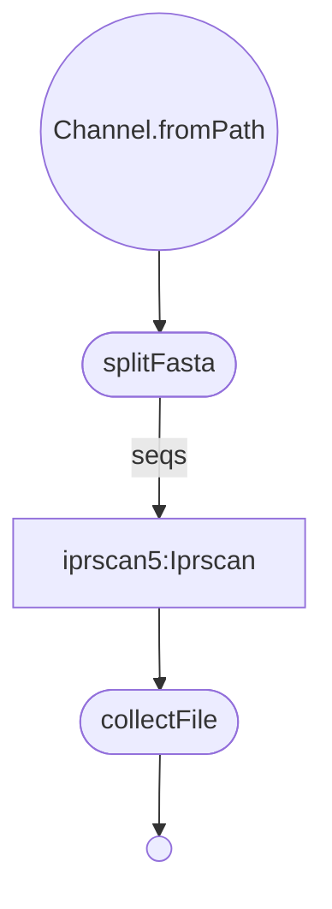

# Nextflow Conversion of Iprscan5Task.pm

***
Iprscan5
***  

### Get Started
  * Install Nextflow
    
    `curl https://get.nextflow.io | bash`
  
  * Run the script
    
    `nextflow run VEuPathDB/Iprscan5 -with-trace -c  <config_file> -r main`

Decription of nextflow configuration parameters:

| param         | value type        | description  |
| ------------- | ------------- | ------------ |
| seqFile  | string | Path to input file |
| outputDir | string | Path to where you would like output files stored |
| outputFile | string | How you would like the outputFile to be named |
| appls | string | Comma separated list of analyses (options are PANTHER, SMART, TIGRFAM, Gene3D, PIRSF, CDD, Pfam, SUPERFAMILY, ProSiteProfiles, MobiDBLite, PRINTS, Coils, ProSitePatterns), if none are specified, all will be run. |

Notes

In order to run this workflow, you will need to download the needed data files and the RpsbProc software and map them into the docker container. These can be downloaded like so

`wget ftp://ftp.ebi.ac.uk/pub/software/unix/iprscan/5/5.51-85.0/alt/interproscan-data-5.51-85.0.tar.gz`

`wget ftp://ftp.ebi.ac.uk/pub/software/unix/iprscan/5/5.51-85.0/alt/interproscan-data-5.51-85.0.tar.gz.md5`
 
`wget https://ftp.ncbi.nlm.nih.gov/pub/mmdb/cdd/rpsbproc/RpsbProc-x64-linux.tar.gz`
 
`md5sum -c interproscan-data-5.51-85.0.tar.gz.md5` 
 
`tar -pxzf interproscan-data-5.51-85.0.tar.gz` 
 
`tar -pxzf RpsbProc-x64-linux.tar.gz`

These can then be mapped into the container in the docker runOptions in the nextflow config like so

`docker {
    enabled = true
    runOptions = "-v /pathtodata/interproscan-5.51-85.0/data:/opt/interproscan/data -v /pathtoRpsbProc/RpsbProc-x64-linux/*:/opt/interproscan/RpsbProc-x64-linux/"
}`

You may run into the error

`Error: File format problem in trying to open HMM file /opt/interproscan/data/gene3d/4.3.0/gene3d_main.hmm.`
`Opened /opt/interproscan/data/gene3d/4.3.0/gene3d_main.hmm.h3m, a pressed HMM file; but format of its .h3i file unrecognized`

Here is how I solved this problem. I pulled and ran veupathdb/iprscan5. I then copied the interproscan data dir into the container at /opt/interproscan/data. You can then run the following commands.

`/opt/interproscan/bin/hmmer/hmmer3/3.3/hmmpress -f data/pirsf/3.18/sf_hmm_all`
`/opt/interproscan/bin/hmmer/hmmer3/3.3/hmmpress -f data/gene3d/4.3.0/gene3d_main.hmm`
`/opt/interproscan/bin/hmmer/hmmer3/3.3/hmmpress -f data/hamap/2020_05/hamap.hmm.lib`
`/opt/interproscan/bin/hmmer/hmmer3/3.3/hmmpress -f data/panther/15.0/panther.hmm`
`/opt/interproscan/bin/hmmer/hmmer3/3.3/hmmpress -f data/pfam/33.1/pfam_a.hmm`
`/opt/interproscan/bin/hmmer/hmmer3/3.1b1/hmmpress -f data/sfld/4/sfld.hmm`
`/opt/interproscan/bin/hmmer/hmmer3/3.1b1/hmmpress -f data/superfamily/1.75/hmmlib_1.75`
`/opt/interproscan/bin/hmmer/hmmer3/3.3/hmmpress -f data/tigrfam/15.0/TIGRFAMs_HMM.LIB`

Once this is done, you should not run into any errors.
